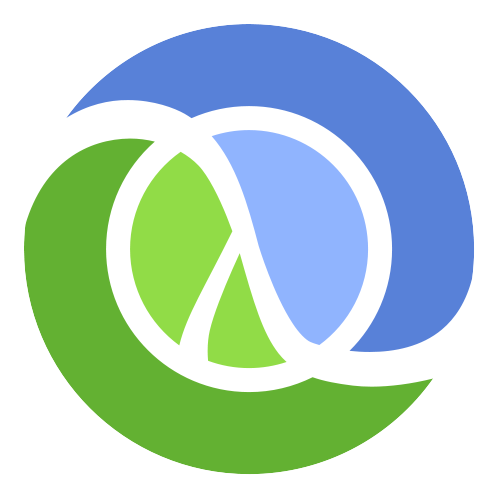

class: center, middle

# ClojureScript + Om = ♥

???

- Przywitaj się.
- Krótko o sobie.

---

class: center, middle

# ClojureScript

???

- Opowiedz dlaczego ClojureScript.
- Prezentacja nie wymaga znajomości języka, na początku przejdziemy sobie powoli przez podstawowe elementy.

---

class: center, middle

.left[
  # React.js
  
]

.right[
  # Om
  
]

???

- Opowiedz dlaczego React.js.
- Opowiedz dlaczego akurat Om, powiedz o alternatywach (Reagent, Quiescent).

---

# Agenda and Flow

### Code and Concepts

- [afronski/om-my-game-of-life](https://github.com/afronski/om-my-game-of-life)

### Components and State
### Unique Selling Proposition
### Summary

???

- Krótko o przebiegu prezentacji - mało slajdów, dużo praktyki.
- Przejdziemy przez proces tworzenia kompletnej aplikacji.
- Opowiemy sobie w szczególności o komponentach i zarządzaniu stanem aplikacji.
- Chcę również pokazać coś, co bardzo mocno zmienia optykę i sposób patrzenia na tworzenie aplikacji.
  - *True SRP*.
  - Undo / Redo
- Na koniec podsumujemy całość i zaprezentuję materiały, które pozwolą na samodzielną eksplorację.

---

class: center, middle

# Demo

???

- No dobra, zaczynamy!
- Będę poruszał się po tagach aż do końca, pokażę też część przykładów jako `diff`.
- Jeśli coś będzie niejasne - pytajcie śmiało! :)

---

# What's missing?

.nice[
- Channels
- Only one state
- Too much global state
- AJAX
- Back-End
]

???

- Czego brakowało w przykładzie?
  - Brak zastosowania *channels* - ułatwia komunikację.
  - Tylko jeden stan aplikacji, jeden atom - nic nie stoi na przeszkodzie żeby to rozdzielić.
  - Za dużo rzeczy w globalnym stanie, można wiele rzeczy przerzucić do lokalnego stanu.
  - Brak komunikacji z serwerem, *`core.async` for the rescue*.
  - W przykładzie nie ma żadnego back-endu, nic nie stoi na przeszkodzie żeby użyć Clojure, Node.js, Ruby etc.

---

# What next?

### I can't use ClojureScript...

- [mori](http://swannodette.github.io/mori)
- [immutable.js](http://facebook.github.io/immutable-js)

### Gimme moar!

- [Todo MVC](http://swannodette.github.io/todomvc/labs/architecture-examples/om)
- [Goya - Digital Pixel Editor](http://jackschaedler.github.io/goya)
- [Blog Anny Pawlickiej](http://annapawlicka.com)
- [core.async](https://www.youtube.com/watch?v=enwIIGzhahw)
- [Flux](https://facebook.github.io/flux)

### This *om*&nbsp; and *react*&nbsp; are stupid...

You can always use AngularJS instead ;)

???

- Jeśli nie możesz użyć *ClojureScript*, możesz dodać do projektu biblioteki czysto JSowe, które wspierają *immutable data structures*. *Mori* stworzył David Nolen (autor *Om*, jeden z głównych programistów *core.clojurescript*), *Immutable.js* to nowy projekt, od Facebooka - twórców React.js.

- Jeśli chcesz więcej - polecam przeanalizowanie Todo MVC (referencyjna implementacja twórców *om*), niesamowity projekt Goya - wypasiony edytor do grafiki typu *pixel art* napisany w całości w *ClojureScript* i *Om*.

- Bardzo wartościowy był dla mnie blog Anny Pawlickiej, wiele tematów dotyczy samego języka jak i *Om* również. Zdecydowanie zachęcam do zgłębienia tajników biblioteki standardowej, zwłaszcza do *core.async*.

- Na koniec zachęcam do poczytania o *Flux*, architekturze skodyfikowanej przez **Facebook** skupiającą się na budowie złożonych aplikacji *client-side*, za pomocą sprawdzonych wartości zebranych w *React.js*, wynosząc je poziom wyżej jeśli chodzi o abstrakcje.

- Jeśli przykład i prezentacja nie przekonała Cie ani do *Om* ani do *React.js* / *Om*, no cóż - wracaj śmiało do swojego ulubionego frameworka MVC. ;)
---

class: center, middle

# Thanks!
### Questions?
### Tomatoes?

???

- Podziękuj!
- Powiedz o NodeSchool Silesia (odbyło się spotkanie w zeszły piątek).
  - Zapraszamy uczestników, szukamy trenerów i chętnych do budowy nowych warsztatów.
