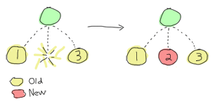
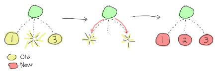
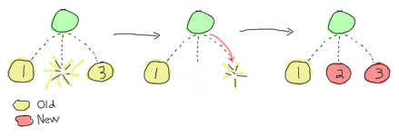

class: center, middle

.footer.smaller[[@afronski](https://twitter.com/afronski)]

???

- Cześć!
- Ja nazywam się Wojtek i chciałbym dzisiaj opowiedzieć Wam o *Elixir*.
- Jak na tak młody język ma on kilka bardzo ciekawych elementów,
  a szczególnie dla osób, które borykają się z pewną klasą problemów.
- Dlaczego wspomniałem o pewnych klasach problemów? Otóż ja na tą
  tematykę trafiłem właśnie poszukując rozwiązania problemu
  stabilności systemów rozproszonych ok. 2 lata temu, i od tamtego
  czasu interesuję się tematyką całego ekosystemu skupionego wokół
  *Erlanga*.
- Jeśli w trakcie prezentacji pojawią się pytania, zgłoście się lub
  przerwijcie - bardzo chętnie odpowiem na każde z nich.

---

# Survey

???

- Ale na początek chciałbym przeprowadzić małą ankietę.
- Proszę o podniesienie ręki w górę i pozostawienie jej jeśli
  odpowiedź na następne pytanie jest również twierdząca.

--

## Erlang?

???

- Kto słyszał o Erlangu?
- Kto cokolwiek napisał w Erlangu?
- Kto deployował aplikację napisaną w Erlangu?
- Kto go dalej wykorzystuje produkcyjnie?

--

## Elixir?

???

- Kto słyszał o Elixir?
- Kto cokolwiek napisał w Elixir?
- Kto deployował aplikację napisaną w Elixir?
- Kto go dalej wykorzystuje produkcyjnie?

- **ACTION**: Podsumuj wyniki.

---

# Why Erlang?

???

- Dlaczego ludzie zaczynają interesować się Erlangiem?

--

- Reliability
- Fault Isolation
- *Let it crash*&nbsp; philosophy
???

- W moim przypadku, poszukiwania rozpoczęła seria problemów skupiona
  wokół braku stabilności wtedy wykorzystywanego rozwiązania.
- Niestety, jakakolwiek rozmowa na temat nawet próby przepisania
  małego fragmentu systemu w celu weryfikacji, była ucinana już na
  samym początku.
- Ktoś może się zdziwić dlaczego nie mówię tutaj wprost o słynnych *9
  nines of reliability* - sukces tego konkretnego przypadku to nie
  tylko zasługa *Erlanga*.
- Wolę wykorzystać inny przykład - najdłużej działający bez przerwy
  (dosłownie **bez przerwy**) system jest właśnie napisany w *Erlangu*
  i działa nieprzerwanie od 21 lat.
- **ACTION**: Zapytaj kogoś z publiki.

--

- Concurrency
- Functional Programming Language
- *Hot Code Reload*
- Erlang VM
  - ~30 years of experience
???

- Praktycznie zawsze pojawia się jeden z tych powodów, dlaczego ludzie
  są zainteresowani własnie tym ekosystemem.
- Najbardziej pragmatyczny wydaje się ostatni argument - nie da się
  zignorować prawie 30 lat doświadczeń i pracy inżynierów nad maszyną
  wirtualną, która jest tak dopracowana, że spełnia naprawdę najwyższe
  standardy.

---

# Why not Erlang?

???

- Skoro *Erlang* jest tak cudowny, to dlaczego pojawił się nowy język?

--

- Syntax?
???

- Można pomyśleć, że to przez składnie. Kiedy zaczynano pracę nad
  *Erlangiem*, autorzy silnie inspirowali się deklaratywnym stylem
  programowania logicznego dostępnym w *Prologu* i stąd składnia,
  odbiegająca od najpopularniejszej.
- Ale nie oszukujmy się, ten problem da się przezwyciężyć.

--

  - It is not a real problem.
- Tooling
- Documentation
- *Expertise knowledge required*
- Too much boilerplate
???

- Jeśli już przejdziemy problem związany ze składnią, możemy odnieść
  wrażenie, że język został stworzony przez ekspertów dla ekspertów.
- Narzędzia są bardzo surowe, dokumentacja jest dosłownie napisana we
  wcześniej wymienionym stylu.
- To co boli początkujących, to brak menadżera zależności, brak
  dobrego narzędzia do *bootstrapowania* nowego projektu (nawet to
  wymaga znajomości konwencji).
- Bardzo dużo użytecznych abstrakcji wymaga napisania dużej ilości
  kodu, co gorsza część z nich nie jest zawarta w bibliotece
  standardowej.
- Rozszerzalność samej biblioteki standardowej również pozostawia
  wiele do życzenia.

---
class: center, middle

# Why not Erlang?

???
- Gwoździem do trumny jest to "cudo".
  - Na porządku dziennym początkujący muszą się borykać z takim
    komunikatem błędów.

---

# Why Elixir?

.left-column[
  

  .caption[José Valim]
]
???

- Kilka lat temu Jose Valim, jeden z głównych opiekunów Rails,pracował
  nad zagwarantowaniem *thread safe* we frameworku, tak aby można było
  korzystać z efektywnie z wielordzeniowych procesorów, bez dodatkowej
  infrastruktury na serwerze.
- Sam określił to jako frustrujące zadanie, ponieważ sam język i sposób w
  jaki zaprojektowane zostały pewne mechanizmy wewnętrzne tego frameworka,
  bardzo mocno utrudniały to zadanie.
- Poszukując lepszych rozwiązań, napotkał na swojej drodze Clojure,
  Haskell i właśnie Erlanga. Jak sam to określił "pokochał maszynę
  wirtualną i ekosystem, ale nie język programowania".
- Między innymi dlatego, że napotkał wszystkie z wymienionych
  wcześniej problemów.

--

.right-column[
## Inspirations
#### 1. Erlang
#### 2. Ruby
#### 3. Clojure
#### 4. F&#9839;
]
???

- Jose podczas prac, wykorzystał potencjał i lata doświadczeń
  dostępnych w postaci *Erlang VM*, zabrał składnię z *Rubiego*.
- Pozbierał również to co najlepsze z Clojure (makra oraz protokoły) i
  Fsharp (pipes, asynchronous workflows).

--
.center[
  .cleared[
    ### *Standing on shoulders of giants.*
  ]
]
???
- Nie poprzestał na tym i dalej pracuje, i dalej podpatruje co
  ciekawego implementują różne inne społeczności.

---

# Why Elixir?

- *Ruby-like* syntax
- Tooling!
  - `mix` - `gem` + `bundler` + `rake` + `rails` + more...
  - `hex` - *RubyGems*
  - `iex` - `irb`
???
- *Elixir* naprawia wszystkie bolączki zw. z brakiem narzędzi w Erlangu.
- Tak naprawdę podchodzi do tego problemu równie kompleksowo jak *Go* czy *Rails*.

--

- Metaprogramming and Polymorphism
- Standard Library
  - For people
  - Common abstractions
- `a |> b |> c |> d`
???
- Elixir dokłada dużo nowych rzeczy do platformy, wystarczy wspomnieć
  o *Lispowych* makrach czy protokołach - obie rzeczy zaczerpnięte z *Clojure*.
- Popularne abstrakcje zostały opracowane i zebrane w bibliotece standardowej.
- Poza tym, że sama biblioteka jest bardzo rozbudowana to w końcu
  dokumentacja jest pisana dla *ludzi*.
- Wreszcie najbardziej charakterystyczna część czyli *pipes*, które
  pokażemy sobie w praktyce.

--

- Fully compatible with *Erlang*
  - Both directions.
???
- Co najważniejsze, mimo dużej ilości dodatków, *Elixir* jest w pełni
  kompatybilny z Erlangiem - i to w obie strony.
- Oznacza to, że można wykorzystywać biblioteki napisane w Erlangu
  wewnątrz Elixira bez żadnych zmiań i *vice versa*.

---
class: center, middle

# Process

???
- Zanim przejdziemy do kodu, chciałbym przybliżyć najbardziej podstawowy
  budulec w naszym arsenale czyli *proces*.
- Przede wszystkim nie możemy go porównywać do procesu z jakim mamy do
  czynienia w systemie operacyjnym.
- Jest on mały, bardzo lekki, izolowany od całego otoczenia (możemy
  powiedzieć, że w sposób czysty enkapsuluje on nam swój stan),
  istnieje tylko wewnątrz maszyny wirtualnej.
- Popularny sprzęt może spokojnie uciągnąć setki tysięcy procesów.
- Kod wewnątrz procesu wykonywany jest sekwencyjnie, natomiast procesy
  działają równolegle względem siebie.
- Żaden wewnętrzny element procesu lub maszyny wirtualnej nie jest
  współdzielony pomiędzy nimi.
- Każdy process ma przypisany adres, tzw. *PID*. Jeśli mówimy o
  środowisku rozproszonym, gdzie mamy do czynienia z większą ilością
  węzłów do adresu dojdzie też nazwa węzła.
- Komunikacja z nim odbywa się wyłącznie za pomocą przesyłania
  wiadomości do konkretnego adresu.
- Przychodzące wiadomości umieszance są w kolejce, tzw. `mailbox`.

---

# OTP

- *Open Telecom Platform*
- Framework
- *The Common Processes*, Abstracted
  - *Behaviors*

???
- Druga ważna rzecz, bez której nie możemy rozpocząć to *OTP*.
- Nie zrażajcie się *Telecom* w nazwie, tak naprawdę to zbiór dobrze
  zdefiniowanych abstrakcji, które są wspólne dla całej platformy.
- *OTP* != Biblioteka standardowa.
- *OTP* wprowadza tzw. zachowania (ang. *behaviours*), które definiują
  zbiór funkcji jakie nasz moduł musi zaimplementować, aby móc
  wykonywać daną funkcjonalność.

--
  - Generic implementations:
     - Application
     - Server
     - Supervisor
     - Event emitter
     - *FSM*
     - Sockets

???
- *OTP* definiuje wiele wspólnych abstrakcji m.in. aplikację, serwer
  obsługujący żądania typu *request-reply*.
- Od strony technicznej, możemy myśleć o tym jak o klasie
  abstrakcyjnej, z której dziedziczymy i implementujemy tylko
  specyficzne zachowania a cała reszta (tzw. boilerplate) jest
  zaimplementowana wewnątrz bazowej struktury - modułu, który wystawia
  dane zachowanie.

---
class: center, middle

# Supervisor

???
- Najbardziej kluczowy zachowaniem z punktu widzenia stabilnych i
  niezawodnych systemów jest *Supervisor*.
- Po polsku możemy to tłumaczyć jako *nadzorca*, *przełożony*.
- To co widzimy na rysunku to tzw. *supervison tree*, złożone ze
  standardowych procesów i właśnie *supervisorów*.
- Każdy *supervisor* nadzoruje inne procesy, jest odpowiedzialny za
  ich start, restart (poprawny lub niepoprawny) i shutdown.
- Dzieki temu, możemy skupić się na tworzeniu izolowanego procesu,
  który w przypadku błędu zakończy swoje działanie, a proces nadrzędny
  zadecyduje czy ten typ błędu powinien spowodować restart czy
  eskalacje błędu wyżej.
- Zainteresowanych zachęcam do lektury i szczególnie zainteresowanie
  się tzw. koncepcją *error kernel*.

---
class: center

### Restart Strategy

???
- Powiedzieliśmy o restartach, warto zapoznać się z tym jakie mamy
  możliwości aby nimi sterować.
- Widzimy wyraźnie, że proces nadrzędny może zrestartować tylko jeden
  proces, wszystkie lub resztę procesów zależnych od aktualnie
  restartowanego.
- Dzięki kombinacjom tych strategii ułożonych w drzewo, mamy
  nieograniczone możliwości budowy najbardziej złożonych hierarchii.

---

# Demo

[Source Code](https://github.com/afronski/echo-protocol-in-elixir)

- Visualization
- Spawning processes
- Message passing mechanisms
- Pattern matching
- Pipes
- Supervisor
- Restarting Strategies

???
- Teraz możemy wskoczyć do kodu!
- Nie będę skupiał się zbytnio na składni, ponieważ nie za bardzo
  różni się od klasycznej składni dostępnej w *Rubym*.
- Chciałbym skupić się przede wszystkim na omówieniu procesów, ich
  mechaniki oraz na *supervisorach*.

---

# Summary

- Elixir is a **concurrency** oriented programming language, focused on:
  - Reliability
  - Scalability
  - Fault-tolerance
  - Developer happiness and productivity

???
- Podsumowując, *Elixir* idealnie nadaje się do pewnej klasy problemów, łączy w sobie wiele bardzo fajnych cech innych języków, a do tego jest zgodny z tą samą filozofią co *Ruby* - czyli sprawia przyjemność progamiście.
- Złośliwi mówią, że w Erlangu bardzo trudne rzeczy robi się bardzo prosto, natomiast bardzo proste wymagają olbrzymiego nakładu pracy. Po części się z tym zgadzam i co więcej - wydaje mi się, że *Elixir* zmienia ten stan rzeczy, czyniąc rzeczy bardzo proste wykonalnymi i przyjemnymi.

--

.spacing[
  .center[*It didn’t take long, but pretty soon my gut feeling kicked in. This is good shit.*]
  .right[Joe Armstrong]
]
???
- I na koniec rekomendacja od jednego z autorów *Erlanga* - tak podsumował swój pierwszy tydzień z *Elixirem*. ;)

---
class: middle

.huge[Thanks!]
.center[Questions?]

.credits[
Image credits:
  - [Elixir](http://elixir-lang.org)
  - [Jose Valim](http://www.erlang-factory.com/sfbay2015/jose-valim)
  - [Learn You Some Erlang](http://learnyousomeerlang.com/)
]

---
class: middle

# Resources

- [Elixir](http://elixir-lang.org)
- [Dave Thomas and Jose Valim - Catalyse Change](https://www.youtube.com/watch?v=Djv4C9H9yz4)
- [Interview with Jose Valim - GOTO Conference](http://www.infoq.com/interviews/valim-elixir)
- [A week with Elixir](http://joearms.github.io/2013/05/31/a-week-with-elixir.html)
- [RFC 862](https://tools.ietf.org/html/rfc862)
