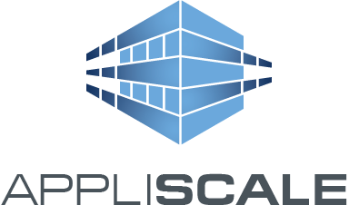

class: center, middle

# Erlang Ecosystem

Wojtek Gawronski (afronski) &copy; 2016

???

- Przywitaj się.
  - Cześć wszystkim! Ja jestem Wojtek i mam do opowiedzenia 4 historie.
  - Ale zanim przejdziemy do konkretów, krótko o mnie i o firmie gdzie pracuję,
    ponieważ jest to super ważne w tym kontekście.

---
class: center, company

### `~ # whoami`

### Ad tech, RTB
### Scalability and Cloud Computing

???

- Software Engineer - blisko 8 lat doświadczenia.
- W samym Appliscale od ponad pół roku, i ten okres dał mi niesamowitego kopa
- Opowiedz o firmie i wyzwaniach (consulting, opieka nad systemem i jego rozwój):
  - Duża przepustowość i skalowanie aplikacji
  - Ad tech (RTB)
  - Cloud Computing
  - Współpracujemy z dużymi firmami - z AOL.

---
class: center, middle

# 1
## Optimized for Operations

???

- Zaczniemy trochę przekornie - nie od przedstawienia technologii, ale od
  prezentacji na co ona nam pozwoliła.

---
class: center, middle

### Software Engineer

--

### SRE (Operations, DevOps)

--

### Data Scientist

---
class: center, middle

## 10 people
#### Almost 7.5 billions of daily operations, 09.2016
#### Deployments every week
##### Developing features
##### Handling production issues
##### Investigating support tickets.

---
class: center, middle

# How?

---
class: center, middle

## Thanks to:
### Bullet-proof technologies, which are battle tested and optimized for sleep

---
class: center, middle

## Erlang anyone?

---
class: center, middle

# 2
## Battle-tested and Proven

---
class: center, middle

# Created in 1986
# Prehistoric?

---
class: center

### Check!

--

#### Call of Duty?

--

#### League of Legends?

--

#### Facebook chat up to 2008?

--

#### WhatsApp?

--

#### Data transfer in smartphone?

---
class: center, middle

#### Interesting language brings interesting domains:

### Telecom, Messaging (XMPP), VoIP
### Game Servers, IoT, Databases
### AdTech, RTB, FinTech

---
class: center, middle

## Industrial implementation of mathematical theory (Actor Model)
### Independently discovered!

---
class: center, middle

# 3
## Optimized for sleep

---
class: center, middle

# Story time!

TODO: External services failures, we're stable.
TODO: Built-in back-pressure in many places.
TODO: Let it crash!
TODO: Self-healing from transient errors (supervision).

---
class: center, middle

# 4
## Modern

TODO: Tooling
TODO: Libraries
TODO: rebar3
TODO: Elixir (mix, Phoenix, hex)
TODO: Stable and steady evolution of VM

---
class: center, middle

# Thanks! ;)

## P.S. We're recruiting!

---

# References

- TODO
- [Erlang: The Movie ;)](https://www.youtube.com/watch?v=xrIjfIjssLE)
