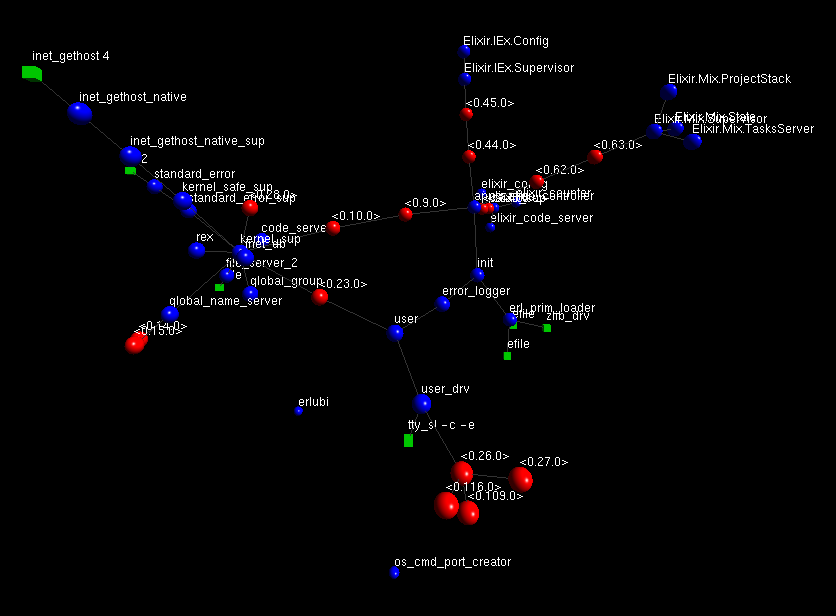

class: center, middle

# Erlang Ecosystem

Wojtek Gawronski (afronski) &copy; 2016

???

- Przywitaj się.
  - Cześć wszystkim! Ja jestem Wojtek i mam do opowiedzenia kilka historii.
  - Zanim zaczniemy, chciałbym Was poznać - ankieta Dev / QA / Manager.
    - Dla każdego coś się znajdzie.
  - Zanim przejdziemy do konkretnych historii, krótko o mnie i o firmie gdzie
    pracuję, ponieważ jest to bardzo ważne w tym kontekście.

---
class: center, company

### `~ # whoami`

### Ad tech, RTB
### Scalability and Cloud Computing

???

- Software Engineer - blisko 8 lat doświadczenia.
- W samym Appliscale od ponad pół roku, i ten okres dał mi niesamowitego kopa
- Opowiedz o firmie i wyzwaniach (consulting, opieka nad systemem i jego rozwój):
  - Duża przepustowość i skalowanie aplikacji
  - Ad tech (RTB)
  - Cloud Computing
  - Współpracujemy z dużymi firmami - z AOL.

---
class: center, middle

# 1
## Optimized for Operations

???

- Zaczniemy trochę przekornie - nie od przedstawienia technologii, ale od
  prezentacji na co ona nam pozwoliła.
- Nie tak jak każda prezentacja o Erlangu - nie chcę zacząć od technologii.

---
class: center, middle

### Software Engineer

???

- Nasze typowe role w projekcie - tu na moim przykładzie, ale generalnie w
  ramach zespołu staramy się wymieniać różnymi "czapkami".
  - Wcielamy się w rolę, uczymy się nazwajem i wymieniamy wiedzą.

--

### SRE (Operations, DevOps)

--

### Data Scientist

---
class: center, middle

## 10 people
#### Almost 7.5 billions of daily operations, 09.2016
#### Deployments every week
##### Developing features
##### Handling production issues
##### Investigating support tickets.

???

- To dość dużo jak na tak mały zespół.
- Co więcej - dawniej podobną ilość zadań i za dużo cięższy proces developmentu
  (miesieczny, czy nawet kwartalny) odpowiadało 3x więcej osób.

---
class: center, middle

# How?

???

- Jak to jest możliwe? Jak tak małym nakładem sił i osobo-godzin (bo efektywnie
  to przekłada się na taką jednostkę) jesteśmy w stanie ogarniać tak dużo.

---
class: center, middle

## Thanks to:
### Bullet-proof technologies, which are battle tested and optimized for sleep

???

- Za sukcesem stoi w bardzo dużej mierze wybrana przez Nasz zespół technologia.
- 30 letnia sprawdzona maszyna wirtualna, dojrzałe środowisko, dojrzałe
  narzędzia i masa wiedzy + problemów rozwiązanych przez duże firmy.
  - Standaryzacja ponad wszystko - wdrożenie nowej osoby do języka i platformy
    jest łatwe i przejrzyste, bo zasady są w dużym stopniu te same.
  - Takie same wymagania postawiono przed utrzymaniem - zasady, jakie obowiązują
    jeśli chodzi o pracę związaną z typowym wsparciem, *operations* i wdrożeniem
    są jasno określone, stabilne a narzędzia do tego wykorzystywane są
    sprawdzone.
  - Oczywiście sam język i platforma bardzo nam pomogły, ale o tym powiem
    później.

---
class: center, middle

## Erlang anyone?

???

- Ktoś zapyta o czym ja mówię - o czymś starym, niemodnym, zapomnianym.
- Kto w dzisiejszych czasach zatrzyma się nad 30 letnią technologią?
  - W dalszej części prezentacji pokażę, że to może być solidna podstawa do dużo
    nowszych i równie ciekawych rozwiązań, które są bardziej współczesne.

---
class: center, middle

# 2
## Battle-tested and Proven

???

- Zatrzymajmy się właśnie nad tym faktem.

---
class: center, middle

# Created in 1986
# Prehistoric?

???

- I przybliżmy bardzo krótko historię tej platformy.
- Erlang powstał 30 lat temu, 1986 w laboratorium R&D firmy Ericsson.
- Jako język i technologia może wydawać się przestarzały, natomiast maszyna
  wirtualna oraz społeczność (ekosystem) skupiony dookoła posiadał wiele
  elementów dużo wcześniej.
  - Przykładem może być wsparcie dla wielu procesorów w 2005, wsparcie do budowy
    systemów rozproszonych w 1993 czy podejście "mikroserwisowe" do budowy
    systemów (w tym ekosystemie mówimy o aplikacjach) w okolicach 1998.

---
class: center

### Check!

???

- Jeśli kogoś nie przekonuje fakt, że technologia może być sprawdzona, mam inny dowód.
- Pokażę Wam, że każdy z Was kiedyś nieświadomie zetknął się Erlangiem - poprzez
  system który jest w nim napisany.
- Sprawdzamy! Jeśli odpowiesz na pytanie twierdząco, pozostaw rękę w górze aż do końca.
  - CoD, LoL - chodzi o chat w grze.
  - Szacuje się, że około 45% światowego ruchu dot. transmisji danych GPRS /
    EDGE / 3G / LTE przechodzi przez switche Ericssona, w których system
    kontrolno-sterujący jest napisany w Erlangu.

--

#### Call of Duty?

--

#### League of Legends?

--

#### Facebook chat up to 2008?

--

#### WhatsApp?

--

#### Data transfer in smartphone?

---
class: center, middle

#### Interesting language brings interesting domains:

### Telecom, Messaging (XMPP), VoIP
### Game Servers, IoT, Databases
### AdTech, RTB, FinTech

???

- Liczne wdrożenia, sprawdzona technologia i pewne cechy języka oraz platformy
  przyciągają ciekawe domeny.
- Szczególnie te które są naturalnie współbieżne, czasu rzeczywistego z
  niesztywnymi wymaganiami czasowymi.
  - Oczywiście domeny zw. z telekomunikacją nasuwają się naturalnie poprzez
    Ericssona.

---
class: center, middle

## Industrial implementation of mathematical theory (Actor Model)
### Independently discovered!

???

- Co ciekawe - twórcy Erlanga (wszyscy skończyli fizykę) niezależnie oparli
  system na teorii matematycznej zwanej *Actor Model*, która została
  udokumentowana i odkryta w USA 5 lat wcześniej.
  - Autorzy języka nie wiedzieli o tych badaniach, dowiedzieli się o nich
    później - gdy ktoś powiedział, że to właśnie to.
  - Gorąco zachęcam do poczytania na ten temat - na potrzeby prezentacji, możemy
    tą matematyczną teorię przybliżyć jako opis i model współbieżnych obliczeń
    oraz wymiany asynchronicznych wiadomości pomiędzy komponentami (aktorami)
    systemu.

---
class: center, middle

# 3
## Optimized for sleep

???

- Chciałbym opowiedzieć o czymś więcej.
- Czymś na co nie zwracałem uwagi, aż do momentu kiedy nie zostałem gościem od
  *operations*.

---
class: center, middle

# Story time!

.image-50[]

???

- Drzewo superwizji i stabilność, propagacja błędów, *error kernel*.
  - Opisać obrazek, opowiedzieć o procesach, aplikacjach.
- *Let it crash*!
  - Self-healing from transient errors (supervision).
  - Built-in back-pressure in many places.
  - External services failures, we're stable (*AlephD*).
- Dlaczego to ma znaczenie?
  - W naszej firmie jest zasada, że w godzinach pracy wspólnie dbamy o stabilność
    platformy i produktu, natomiast po godzinach - po stronie klienta jest
    dedykowane wsparcie, natomiast określone osoby (chętne do tego i oczywiście
    opłacane) są na tzw. dyżurze (3 linia wsparcia, dla obeznanych z tematem).

---
class: center, middle
# 4
## Modern

???

- Mimo tego, że technologia liczy 30 lat, dalej się rozwija.
- Nie stoi w miejscu i została ostatnimi czasy odmłodzona.

---

## Modern

- *Elixir*
  - `hex`
  - `mix`
  - *Phoenix*
  - *Ecto*
- Tools and Libraries:
  - `rebar3`
  - *Cowboy*
- Stable and steady evolution of *VM*.
- Amazing community!
  - [Learn You Some Erlang For Great Good!](http://learnyousomeerlang.com/)
  - [Erlang in Anger](https://www.erlang-in-anger.com/)

???

- Na sam koniec chciałbym wspomnieć o tym co odmładza tę technologię.
- Stanowi ona bardzo dobry grunt i fundament dla nowych, powstających
społeczności.
  - Ostatnimi czasy programiści *Ruby* coraz śmielej spoglądają na *Elixir*,
    czyli język o bardzo podobnej składni, ale zupełnie innej filozofii.
    - Powstają ciekawe frameworki - inspirowany Railsami *Phoenix*, ale jednak o
      zupełniej innej filozofii.
  - Stabilne biblioteki i narzędzia - np. serwer HTTP Cowboy.
- Mało która technologia może pochwalić się tak stabilnym rozwojem na
  przestrzeni 30 lat.

---
class: center, middle

# Thanks! ;)

## Questions?

### P.S. We're recruiting!

???

- Dziękuję za uwagę!
- Pytania?
- Rekrutujemy

---

# References

- [Appliscale](http://appliscale.io)
- [afronski.pl](http://afronski.pl)
- [Erlang](erlang.org)
- [How I Start: Erlang](https://howistart.org/posts/erlang/1)
- [Learn You Some Erlang For Great Good!](http://learnyousomeerlang.com/)
- [Erlang in Anger](https://www.erlang-in-anger.com/)
- [Elixir](elixir-lang.org)
- [Phoenix](http://www.phoenixframework.org/)
- [Erlang: The Movie ;)](https://www.youtube.com/watch?v=xrIjfIjssLE)
