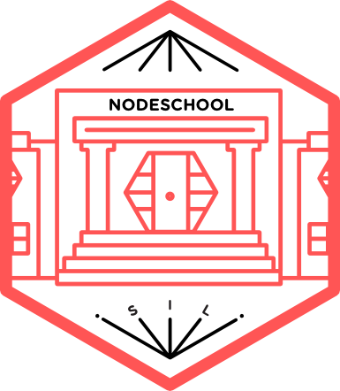
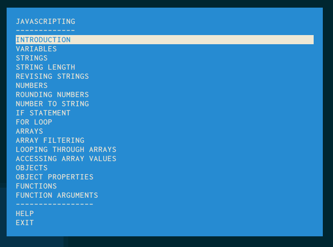

class: center, middle

# NodeSchool - *javascripting*

[nodeschool.io/silesia](http://nodeschool.io/silesia), [@nodeschoolpl](https://twitter.com/nodeschoolpl)

[@rspective](https://twitter.com/nodeschoolpl), [@afronski](https://twitter.com/nodeschoolpl)

???

---

# Let's start!

1. [https://nodejs.org](https://nodejs.org)
2. `node -v`
3. `npm -v`
4. `npm install -g javascripting`
5. `javascripting`

???

---

# Workshopper

???
