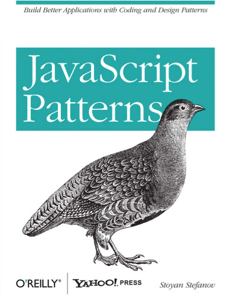

class: center, middle


# NodeSchool - *javascripting*

[nodeschool.io/silesia](http://nodeschool.io/silesia), [@nodeschoolpl](https://twitter.com/nodeschoolpl)

[@rspective](https://twitter.com/nodeschoolpl), [@afronski](https://twitter.com/nodeschoolpl)

[](http://blog.rspective.com)

???

- Cześć!
- Witamy w grupie, która zajmować się będzie podstawami języka JavaScript.
- Korzystać będziemy z warsztatu *javascripting*.

---

# Let's start!

1. [https://nodejs.org](https://nodejs.org)
2. `node -v`
3. `npm -v`
4. `npm install -g javascripting`
5. `javascripting`

???

- Jak zainstalować warsztat?
- Oto kilka kroków jakie należy wykonać, aby go zainstalować.

---

### Workshopper


???

- Oto jak wygląda ekran startowy, tuż po otwarciu warsztatu.
- Poruszamy się za pomocą kursorów, ENTER wybiera aktywną lekcję.
- Do każdego ćwiczenia dołączony jest opis zadania wraz z krótkim wprowadzeniem.

---

# Before we start...


???

- Zanim zaczniemy, opowiemy sobie czym jest JavaScript.
- Na slajdzie widzimy oficjalne logo JS.

--

1. Stworzony w 1995 (*Netscape*).
???

- Język został stworzony w 1995 roku, dokładnie w 7 dni.
- Krótki czas częściowo wyjaśnia problemy zw. z designem języka (*system typów*).

--

2. Autor: *Brendan Eich*
???

- Język został opracowany dla przeglądarki Netscape, nosił na początku nazwę *Livescript*.
- Nazwę zmieniono, inspirując się Javą i jej ideą zw. z przenośnością.
- Autorem jest *Brendan Eich* (były CTO i CEO *Mozilla Foundation*).

--

3. Nazwa standardu: *ECMA-262*
4. Wersje: ES3, ES5, ES5.1, ES6 (*ES2015*).
???

- Oficjalnie standard JavaScript nazywa się *ECMAScript* i ma numer *262*.
- Chronologicznie i pod względem popularności najważniejsza była wersja *ES3*.
- Po *ES3*, bardzo długo przygotowywano wersję *ES4*, która ostatecznie została porzucona.
- Ciekawostka: ActionScript to również ECMAScript - wersja ES3 i nieoficjalna ES4.
- *ES5* to obecnie najpowszechniejsza wersja, od ponad roku twórcy
  przeglądarek implementują standard ES6, przemianowany niedawno na
  ES2015.

---

# Syntax

```javascript
function total(items) {
  var i = 0;
  var sum = 0;

  for (i = 0; i < items.length; ++i) {
    sum += items[i].price;
  }

  return sum;
}

// It will output: 25.0
console.log(
  total([
    { name: "A", price: 12.0 },
    { name: "B", price: 13.0 }
  ])
);
```

???

- Zanim przejdziemy do zadań opowiemy sobie krótko o składni i zasobach.
- Funkcje, Bloki, Zmienne, Pętle.
- Tablice, Obiekty, Liczby.
- `console.log` i inne.
  - `alert` is so 90! ;)

---
class: center, middle

### Resources

.books[
  
  
  
]

???

- I na koniec książki warte polecenia.
- Polecam rozpocząć od *JavaScript: The Good Parts*.
  - Bardzo krótka, przyjazna początkującym książka.
- W następnej kolejności polecam *JavaScript Patterns*.
- Jeśli ktoś jest bardziej zaawansowany i zna inny język programowania,
  zdecydowanie *Test-Driven JavaScript Development* lub
  *JavaScript: The Definitive Guide*.
---

# Image Credits

- [JavaScript, Wikipedia](http://en.wikipedia.org/wiki/JavaScript)
- [tddjs.com](http://tddjs.com)
- [Michael Thelin](http://www.michaelthelin.se/)
- [Tuts+](tutsplus.com)

???

- No to możemy rozpocząć wykonywanie zadań.
- Dziękuję za uwagę!
