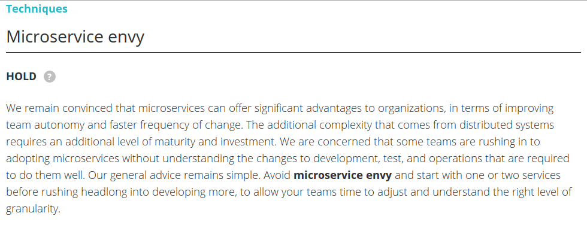
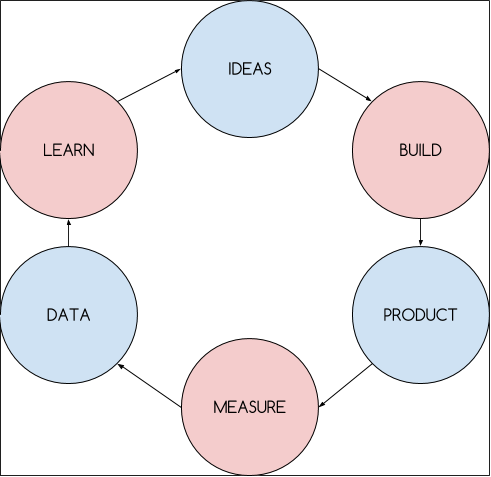

title: Evolution > Revolution – how should microservices be built?
author:
  name: Wojtek Gawroński
  email: contact@white-rook.pl
  twitter: afronski
  github: afronski
  url: http://white-rook.pl
style: stylesheet/main.css
output: presentation.html
controls: true
theme: sjaakvandenberg/cleaver-dark

--

# Evolution > Revolution

## How should microservices be built?

--

# *It is about maturity in systems design*

## **Disclaimer**: this is not a *tech talk*

-- center

# 4 stories

## Microservices ain't something *new*
## Know your *domain*
## *Evolution* is the key
## Tale about *complexity*

-- logos

### `~ # whoami`

> pragmatic *system builder*, sometimes *software writer*

--

### Microservices ain't something *new*

> Any sufficiently complicated concurrent program in another language contains an ad hoc informally-specified bug-ridden slow implementation of half of Erlang and OTP.

*Virding's First Rule of Programming*

  

    
    
  

  

    
  

#### Other examples:

- *SOA*, *CORBA*
- Hardware, *UNIX*, *Linux*
- **Erlang**
- *Akka*, *Orleans*
- Virtualization, *Unikernels*

-- full-page

### Know your *domain*

> Avoid microservice envy and start with one or two services before rushing headlong into developing more, to allow your teams time to adjust and understand the right level of granularity.

Source: https://www.thoughtworks.com/radar/techniques/microservice-envy

-- lean

### *Evolution* is the key

-- mfowler-sketch

### Tale about *complexity*

> People are bad at predicting the performance of complex systems [...], our ability to create large and complex systems fools us into believing that we're entitled to understand them.

Carlos Bueno, *Mature Optimization Handbook*

--

# There is no *silver bullet*

## Let's finally admit that and be **mature**

## Thank you!

--

### Resources

#### Microservices ain't something *new*

1. [Garrett Smith - Software As Biology](https://www.youtube.com/watch?v=IorTNHv37XI)
2. [Virding's First Rule of Programming](http://rvirding.blogspot.com/2008/01/virdings-first-rule-of-programming.html)
3. [Actor Model and Erlang relationship](http://rvirding.blogspot.com/2008/01/virdings-first-rule-of-programming.html?showComment=1400761539472#c5295780053912797163)
4. [Actor Model of Computation: Scalable Robust Information Systems](http://arxiv.org/pdf/1008.1459v38.pdf)

#### Know your *domain*

1. [Microservices envy](https://www.thoughtworks.com/radar/techniques/microservice-envy)
2. [Monolith first](http://martinfowler.com/bliki/MonolithFirst.html)
3. [Microservices Guide](http://martinfowler.com/microservices/)

--

### Resources

#### *Evolution* is the key

1. [Chad Fowler - From Homogeneous Monolith to Radically Heterogeneous Microservices](https://www.youtube.com/watch?v=v17DMiFHnB8)
2. [Migrating to Microservices by Adrian Cockroft (Part 1)](https://www.youtube.com/watch?v=1wiMLkXz26M)
3. [Migrating to Microservices by Adrian Cockroft (Part 2)](https://www.youtube.com/watch?v=ebCtNmTVIJY)

#### Tale about *complexity*

1. [Microservices prerequisites](http://martinfowler.com/bliki/MicroservicePrerequisites.html)
2. [The Mature Optimization Handbook](https://www.facebook.com/notes/facebook-engineering/the-mature-optimization-handbook/10151784131623920)
3. [No Silver Bullet](http://worrydream.com/refs/Brooks-NoSilverBullet.pdf)
4. [Distributed systems - for fun and profit](http://book.mixu.net/distsys/)
