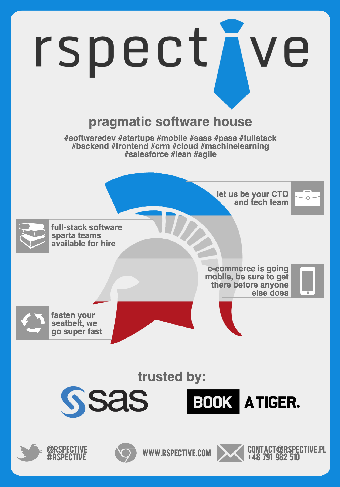
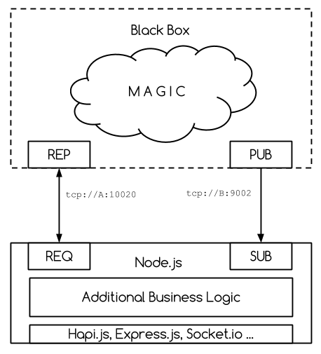
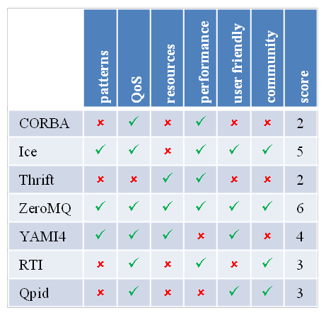
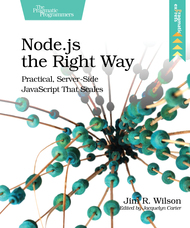

class: center, middle

[](http://zeromq.org)

# ZeroMQ in Node.js

Wojtek Gawronski - [@afronski](https://twitter.com/afronski)

.logos[
[](http://blog.rspective.com)
[](http://nodeschool.io/silesia)]

[@rspective](https://twitter.com/rspective), [@nodeschoolpl](https://twitter.com/nodeschoolpl) 

???

- Hello!
  - I've participated in Berlin.js several times and now it is my turn to give back to the community.
  - We should be grateful that the organizers are doing such wonderful job here - round of applause for them, please!
- Before we start, I'd like to briefly introduce me and our company.

---
class: center

# `~ $ whoami`

[](http://www.rspective.com/?utm_source=zeromq-in-nodejs&utm_medium=offline-presentations&utm_campaign=presentations)

???

- My name is Wojtek Gawroński (@afronski). I am a part of a rspective team.
  - We are a pragmatic software house based in Katowice, Poland, but we also have an office in Berlin.
    - We are here at least once in a month.
  - We help startups automate their operations from IT perspective - full-stack (*web* and *mobile*).
    - We are the tech team behind `BOOKATIGER`, a skyrocketing Berlin start-up founded by *ex-Delivery-Hero* co-founders.
    - But we also working with bigger companies, like e.g. SAS institute.
- We are also giving back to the community:
  - We are regularly organizing NodeSchool Silesia
  - We are bootstrapping other meet-ups in the Silesian region
  - And also we are cooperating with local Hackerspace community.
- Enough of this - let's go to the details!

---
class: center, middle

# Agenda

### Our Use Case
### Brief overview what ZeroMQ is
### Diving into small case study

???

- When I present something, I always try to have a real example. Likewise today, I will start with description of our use case
- Then, we will fluently move to the capabilities and features of ZeroMQ, and we will briefly talk about pattern language defined there.
- And after that, we will see how the actual implementation looked like and with what kind of challenges we have dealt during that project.

---
class: center, middle

# Our Case Study



???

- I can't disclose too many details regarding domain or the actual technicalities e.g. schema, protocols or algorithms.
  - But I all technicalities related with ZeroMQ and Node.js are identical to the ones in the original problem.
- Basically, we have to built additional visualization layer on top of existing system.
  - It is battle-proven working piece of machinery, so there was no need to change that.
  - Even, if there was a need to changing it - it won't be possible in the project schedule.
- In that system, we already had an integration points built with use of ZeroMQ.
  - So our job was to integrate, deploy and enhance existing product.
  - Integration via `HTTP` was impossible (e.g. limitations).
- Before we dive into more details, quick questions:
  - How many of you are familiar what ZeroMQ is?
  - How many of you worked with that library?
- For someone, which faces this topic first time, probably many terms and acronyms have no meaning.
  - So let's talk about that library and its terminology.
  
---

# `ZeroMQ`

- Created by *Pieter Hintjens* and *Martin Sustrik* around 2007.
- *It is a community of projects focused on decentralized computing*.

???

- It was created around 2007 by two guys - *Pieter Hintjens* and *Martin Sustrik*.
- It is like set of patterns built around *socket API on steroids*.
  - It provides additional features on top of a standard *socket-like API*.
    - Think about reconnecting, queuing, handling overload.
  
--
- It is **[brokerless](http://zeromq.org/whitepapers:brokerless)**.

???

- Brokerless means that there is no central point of synchronization.
  - You are not limited with your architecture of choice.
  - But it means, that the queue needs to be somewhere.
  - And it is - depending of used abstraction it is on sending, receiving or both sides.

--
.images[]

???

- *CERN* scored `ØMQ` as a most versatile solution for their middleware infrastructure.
  - Basically whole messaging system which are responsible for steering accelerators is running on top of *ZeroMQ*.
  - Other use cases are similar - highly distributed applications, high performance trading and financial systems, recently *IoT*.

--
- *Lean* approach to every single aspect other than *messaging*.
- Alternatives - *AMQP*, *nanomsg*.

???

- Its core contains only necessary things.
  - For you it can be a drawback or advantage - *it depends*.
  - No service discovery mechanisms, no default payload format, no security mechanism is enforced on you. 
- Direct alternatives are either:
  - Overly complicated and development was stopped (*AMQP*).
    - *FTR*: I mean here only a protocol - other tools which are using it (e.g. RabbitMQ) are focused around *broker*.
  - Or you need to deal with smaller community, more immature product and higher bus factor (*nanomsg*).

---

# `ZeroMQ` - Philosophy

- You are building a *distributed system*.
  - *Microservices* or *SOA* anyone?

???

- This guys defined (or actually reused) good communication patterns a way before the *microservice* era.
  - Yes, I'm smirking here - *Microservice* or *SOA* is nothing new.
- It is all about decoupled services that have only one responsibility and they are doing it really well.
  - In that particular context it will be nice to have a unified meaning, common patterns and well understood approach.

--
- Community *FTW*!
  - [Collective Code Construction Contract (C4)](http://rfc.zeromq.org/spec:22)

???

- Its evolution is driven truly by a community.
  - All protocols, enhancements, patterns are prepared and described as RFCs.
  - C4 process is also prepared and maintained as a RFC.
- Obviously, not always making decisions via community is good.
  - But it is definitely better that doing it via committee.
  - Less bus factors, less leadership issues, it is easier to create a compromise.

--
- What is a *Lazy Pirate*?
  - [Pattern Language](http://zguide.zeromq.org/page:all#Client-Side-Reliability-Lazy-Pirate-Pattern)

???

- I have already spoke about that partially.
  - Imagine, that you are designing a new distributed system and you already have a predefined, well tested and documented set of patterns and best practices.
    - That will help you avoiding pitfalls.
    - You will probably avoid very expensive mistakes, especially if you are at the beginning of your journey.
  - Many patterns are prepared in a form of a *RFC* and also described inside *ZGuide* and various books.

--
- [Queues (or brokers) don't fix the overload](http://ferd.ca/queues-don-t-fix-overload.html)
  - You need to either drop messages or block yourself.
    - [High-Water Marks](http://zguide.zeromq.org/page:all#High-Water-Marks)

???

- When you dealt with distributed systems, you probably know that queues are not fixing overload problems.
  - Instead of fixing the origin of the problem, you are postponing the death of your system.
  - And often also you are masking the original issue by moving it to different place in your system.
- It is always necessary to deal with overload via some form of *flow control*.
  - *ZeroMQ* uses *high-water mark* mechanism for that.
  - It means that after collecting 'N' messages in the (either in sending or receiving) queue it will start drop messages or block a socket (depending on the type).

---

# ZeroMQ - Transport Layer

- [ZMTP - ZeroMQ Message Transport Protocol](http://rfc.zeromq.org/spec:23)
  - Secure, credit-based links between peers over transport layer.
     - `TCP`, `PGM`, but also `IPC` or `inproc`
  - *Peer-to-Peer* protocol.
  - Most recent version: `3.0`
     - Fully *backward compatible*.
  - License: *GPLv3* 
???

- This is the core of the *ZeroMQ*.
  - This protocol defines *framing*, mechanisms for preserving backward compatibility, seams for security layer and defines behavior e.g. for reconnecting mechanisms.
- It is defined as a separate *RFC* in the *ZeroMQ* - *RFC 23* is for third version of that protocol.
- It is deliberately distributed with such permissive license.
  - It is a protection that someone will create a incompatible fork of `ZMTP`.

---

# ZeroMQ - Payload and Security

- *Payload* format is up to you.
  - You need to handle it on your side.


- *Security* is up to you.
  - There are implementations available inside *ZeroMQ*.
     - `NULL`, `PLAIN`, `CURVE`, `GSSAPI`

???

- *ZeroMQ* employs *UNIX* philosophy and focuses on the *socket*, *messaging* and *protocols*.
  - Anything besides that you need to handle on your side.
- Good or bad?
  - It is an advantage - because no one forces you to use something you don't want or need.
  - It can be a drawback - because you need to handle it by yourself.
- In most use cases, you already know what to do with this two things.
  - In our case we need to deal with a proprietary format.
  - And our network environment was a trusted LAN.

---

# ZeroMQ - Interoperability

- It is *easy*!
  - Unified pattern language.
  - Unified abstractions.


- Unified protocol implementation across programming languages.
- *Protocols* are well defined and backward compatible.


- Similar *API* and *behaviour* in provided client libraries.

???

- ZeroMQ are solving multiple problems related with interoperability.
  - It provides a unified protocol implementations across programming languages.
  - In the example code we have cooperation between *Erlang* and *Node.js*.
    - Thanks to the common abstractions and unified view, it is easy to glue them together.
    - It is also easier to think with and reason about building blocks.
  - You have got backward compatibility handled at the protocol level.
    - As well - corner cases and differences related with platforms, *OS* and programming languages.
- In other words - you can finally choose a programming language as a tool, without any worries that it will slow you down.
  - Communication patterns are handled by the library.
  - Even when you design your services separately, you are sharing common thinking, ideas and building blocks in whole system.

---

# Case Study - Library

- `npm install --save zmq`
- `package.json`:

```json
"dependencies": {
  "zmq": "~2.11.0"
}
```

- `server.js`:

```javascript
"use strict";

const zmq = require("zmq");

const subscriber = zmq.socket("sub");
const requester = zmq.socket("req");
```

- `node --harmony server.js`

???

- It is a library with native code.
  - It will compile all necessary dependencies.
  - But it can be problematic on 
- I encourage you to use `ES2015` (former `ES6`) and `--harmony` mode to support all goodies from the newest standard.

---

# Case Study - Sockets and Abstractions

- [`REQ` and `REP`](http://rfc.zeromq.org/spec:28) - typical synchronous *RPC*.
- `sender.js`

```javascript
// Sending message and handling response.
requester.send(stringifiedPayload);
requester.on("message", function (response) {
    console.info("Received response: %s", response);
});

requester.connect("tcp://0.0.0.0:10020");
```

- `receiver.js`

```javascript
const responder = zmq.socket("rep");

responder.on("message", function (data) {
    // Do hard work and calculate response. 
    responder.send(response);
});

responder.bind("tcp://0.0.0.0:10020");
```

???

- In our example I would like to focus on two abstractions.
- First we will talk about classic synchronous RPC represented as a `REQ-REP` socket pair.
  - It is synchronous on the socket level - so it means that communication is synchronous.
  - Library itself (and in consequence event loop underneath) uses as much as it can an asynchronous approach.
  - So no worries about synchronous code.

---

# Case Study - Sockets and Abstractions

- [`PUB` and `SUB`](http://rfc.zeromq.org/spec:29) - typical *fan-out*.
- `sender.js`

```javascript
const publisher = zmq.socket("pub");

// Do hard work and publish events.
publisher.send(stringifyEvent);

publisher.bind("tcp://0.0.0.0:9002");
```

- `receiver.js`

```javascript
// Subscribe on all messages and handling incoming messages.
subscriber.subscribe("");
subscriber.on("message", function (payload) {
    console.info("Received: %s", payload);
});

subscriber.connect("tcp://localhost:9002");
```

???

- Next, we will handle simple publish and subscribe mechanism.
- Again, API and methods are really simple and cohesive.
  - Wrapper reuses all best practices related with `EventEmitter` and callbacks.
  - Please note, that all messages are send and received as *strings* (and in consequence underneath as a binary buffer).
     - Remember you need to handle payload format on your own (so `JSON`, `protobuf`).

---

# Case Study - Signals

- ZeroMQ's error handling philosophy is a mix of *fail-fast* and *resilience*.
  - *Processes* should be:
     - As vulnerable as possible to internal errors.
     - As robust as possible against external attacks and errors.

???

- Internal errors means in most cases either a programmer error - which should be fixed immediately.
- Or operational error like *lack of memory* which probably cannot be fixed from the inside.
  - That is why you should fail-fast in those cases.
  - You should not prepare any error handling for that, especially for programmer errors!
- For protocol designers - use *Postel's Law* with caution. 

--

- Remember about other *OS* signals - `SIGTERM`, `SIGINT` ...

```javascript
process.on("SIGINT", function () {
  console.info("Shutting down...");
  socket.close();
});
```

???

- You should gracefully handle that signals.
  - Be sure that *shutdown* signals will propagate correctly across components in your system.
  - Also be sure that resource owner will release resources correctly during that process.

---

# Case Study - Challenges

- **Distributed Systems** - Different problems and challenges.

- **Designing** - Different patterns and set of abstractions.

- **Deployment** - *IaaS* or addons for *PaaS* (like [Ruppel's Sockets](https://devcenter.heroku.com/articles/ruppells-sockets#connecting-your-app)).


- **Operations** - Dealing with *TCP* (*knowledge*, *harder to maintain*).
- **Operations** - Dealing with *TCP* - Corner cases are *expensive*.
  - *It all depends on your requirements*.

???

- Distributed systems are bringing unusual problems to the table.
  - Deal with it.
- Dealing with *ZeroMQ* enforces you to learn new set of abstractions and use different mindset, than usual one.
  - It may look hard at the beginning, but examples, guides and RFCs are really helpful.
- Major challenge that you will face with *TCP-based* services is that it is not a *PaaS* friendly.
  - You can workaround this by using *VPS*, *IaaS* or providing additional addons to your favorite *PaaS*.
  - Still, it is an additional operational and implementation cost.
- You need to deal with different problems than usual in terms of infrastructure - operation cost will be higher.
  - Especially at the beginning.
  - *ZeroMQ* reduces that significantly - still, some knowledge is required and it can save you hours of debugging.
- Corner cases related with *TCP* are much harder to track and often they are very expensive to fix.
  - Everything depends on your requirements and *SLA*. 

---
class: center

# Resources

.book-covers[
[](http://shop.oreilly.com/product/0636920026136.do)
[](https://pragprog.com/book/jwnode/node-js-the-right-way)
[](https://www.createspace.com/4098511)]

[ZeroMQ Guide](http://zguide.zeromq.org/page:all)

[afronski/btc-txn-zmq-svc](https://github.com/afronski/btc-txn-zmq-svc)

[Peter Hintjens - Distribution, Scale and Flexibility with ZeroMQ](https://www.youtube.com/watch?v=yhGXJ9Jt3-A)

[Matrin Sustrik - ØMQ: A way towards fully distributed architectures](https://www.youtube.com/watch?v=RcfT3b79UYM)

???

- At the end I have attached couple of useful resources.
  - I especially recommend books - "ZeroMQ" from O'Reilly (Warning: there is a lot of C code inside) and "Node.js: the Right Way".
  - Videos will be useful to grasp the ideas and philosophy behind ZeroMQ.
  - Code presented here is available on my Github account.

---
class: center middle

# Thanks! 

[](http://zeromq.org)

## Questions?

###  Tomatoes? 

???

- So that will be all from my side. Thank you!
- Do we have time for questions?
