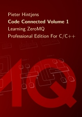

class: center, middle

# ZeroMQ in Node.js

Wojtek Gawronski - [@afronski](https://twitter.com/afronski)

.logos[

]

[@rspective](https://twitter.com/rspective), [@nodeschoolpl](https://twitter.com/nodeschoolpl) 

???

- Hello!
- I've participated in Berlin.js several times and now it is my turn to give back to the community.
- We should be grateful that the organizers are doing such wonderful job - round of applause for them, please!
- Before we start, I'd like to briefly introduce me and our company.

---
class: center

# `~ $ whoami`

???

- My name is Wojtek Gawroński (@afronski). I am a part of a rspective team.
- We are a pragmatic software house based in Katowice, Poland, but we also have an office in Berlin - we are here at least once in a month.
- We are working mostly with start-ups - couple of them are from here, couple are not.
- But we also working with bigger companies, like e.g. SAS institute.
- Instead only retrieving from community, we are also giving back - we are regularly organizing NodeSchool Silesia, we are bootstrapping other meet-ups in the Silesian region, and also we are cooperating with local Hackerspace community.
- Enough of this - let's go to the details!

---
class: center, middle

# Agenda

### Our Use Case
### Brief overview what ZeroMQ is
### Diving into small case study

???

- I always want to present something real. So I will start with describing our use case.
- Then, we will fluently talk about the capabilities and features of ZeroMQ, we will briefly talk about pattern language defined there.
- And after that we will see how the actual implementation looked like and with what kind of challenges we have dealt.

---

# Our Use Case

???

- I can't disclose too many details regarding domain or the actual algorithms, but I promise that the technical side related with ZeroMQ and Node.js is gathered 1:1 from the actual problem.

---

# What `ZeroMQ` really is?

???

---

# What `ZeroMQ` really isn't?

???

---

# Pattern language in `ZeroMQ`

???

---

# Case Study - Description

???

---

# Case Study - Transport Layer

???

---

# Case Study - Payload

???

---

# Case Study - Interoperability

???

---

# Case Study - Challenges

- Deployment - *IaaS* or addons for *PaaS* (like [Ruppel's Sockets](https://devcenter.heroku.com/articles/ruppells-sockets#connecting-your-app))

???

- Major challenge that you will face with *TCP-based* services is that it is not *PaaS* friendly.
  - You can workaround this by using *VPS*, *IaaS* or providing additional addons to your favorite *PaaS*.
  - Still, it is an additional operational and implementation cost.
  
---
class: center

# Resources

.book-covers[
  
  
  
]

[ZeroMQ Guide](http://zguide.zeromq.org/page:all)

[afronski/zeromq-in-nodejs](https://github.com/afronski/zeromq-in-nodejs)

[Peter Hintjens - Distribution, Scale and Flexibility with ZeroMQ](https://www.youtube.com/watch?v=yhGXJ9Jt3-A)

[Matrin Sustrik - ØMQ: A way towards fully distributed architectures](https://www.youtube.com/watch?v=RcfT3b79UYM)

???

- At the end I have attached couple of useful resources.
  - I especially recommend books - "ZeroMQ" from O'Reilly (Warning: C code inside) and "Node.js: the Right Way".
  - Videos will be useful to grasp the ideas and philosophy behind ZeroMQ.
  - Code presented here is available on my Github account.

---
class: center middle

# Thanks! 

## Questions?

###  Tomatoes? 

???

- So that will be all from my side. Thank you!
- Do we have time for questions?
