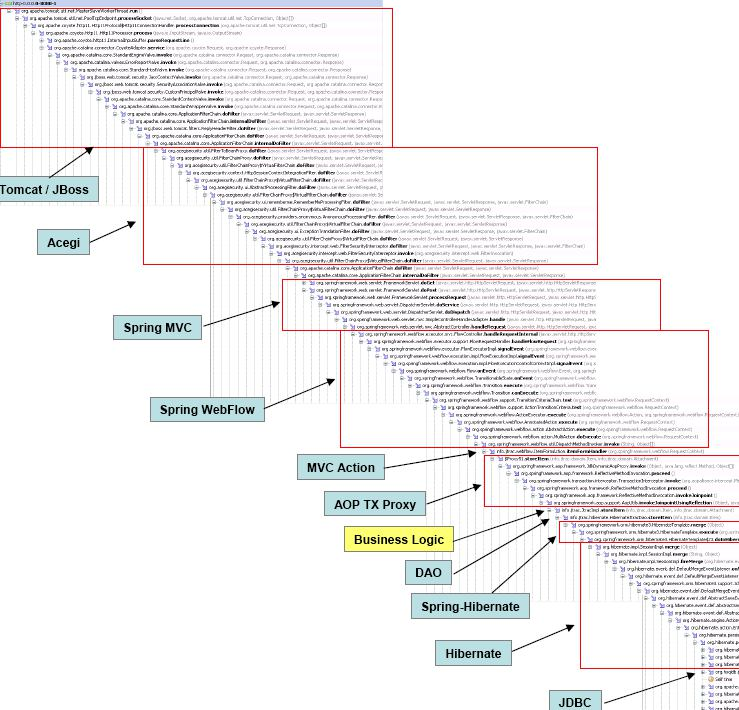
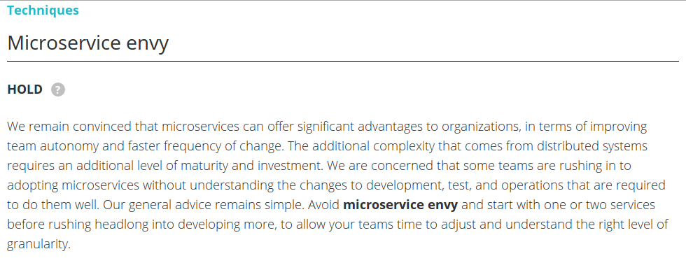

title: Evolution > Revolution – how microservices should evolve
author:
  name: Wojtek Gawroński
  email: contact@white-rook.pl
  twitter: afronski
  github: afronski
  url: http://white-rook.pl
style: stylesheet/main.css
output: presentation.html
controls: true
theme: sjaakvandenberg/cleaver-dark

--

# Evolution > Revolution

## How microservices should be built?

## *About maturity in systems design*

--

# Disclaimer: this is not a *tech talk*

-- center

# 4 stories

## Microservices ain't something *new*
## Know your *domain*
## *Evolution* is the key
## Tale about *complexity*

-- logos

### `~ # whoami`

> pragmatic *system builder*, sometimes *software writer*

[](http://white-rook.pl)
[](http://rspective.com)

--

### Microservices ain't something *new*

#### *SOA*, is that you?
#### *CORBA* in disguise?

-- images

### Microservices ain't something *new*


--

### Microservices ain't something *new*

#### *03.11.1971* - UNIX initial release date
#### Operating systems architecture and design

```
tr 'A-Z' 'a-z' <fnord.txt | tr -cs 'a-z' '\n' | sort | uniq | comm -23 - /usr/share/dict/words

```

-- full-page

### Microservices ain't something *new*



--

### Microservices ain't something *new*

#### *1975* - *Actor Model* formalization
#### *1986* - Erlang was created
#### *1998* - *AXD301* - Erlang system with 99.9999999% reliability
#### *2015* - How many *Erlang*-like framework implementations we have in the wild?

> Any sufficiently complicated concurrent program in another language contains an ad hoc informally-specified bug-ridden slow implementation of half of Erlang and OTP.

*Virding's First Rule of Programming*

--

### Microservices ain't something *new*

#### *Context is the king*
#### We are learning on our failures
#### New is coming?

- *Immutable servers*?
- *Unikernels*?
  - Every good idea has roots in *60s*, *70s* or 80s

-- full-page

### Know your *domain*



> Avoid microservice envy and start with one or two services before rushing headlong into developing more, to allow your teams time to adjust and understand the right level of granularity.

Źródło: https://www.thoughtworks.com/radar/techniques/microservice-envy

--

### *Evolution* is the key

#### TODO

- Co zrobić jak nie ma dojrzałości?
  - Róbmy produkty, nie projekty.
  - To IT żyje dla biznesu, nie odwrotnie. Bez biznesu nas nie ma.
- Zaczynasz od zera, budujesz coś małego, skupiasz się na biznesie i ewoluujesz.
- Agile, Lean, Scientific Method, Data-driven - obojętne, model jest ten sam - buduj, zbadaj&zmierz, wnioskuj -> rinse&repeat.
- Rewolucja (niedojrzałość - róbmy mikroserwisy od jutra!) może zabić Twój biznes.
- Rewolucja to oznaka niedojrzałości - to jest coś czego chcemy (nowy biznes, elastyczność) lub się czegoś boimy.
- Starting with microservices is an anti-pattern.
  - Netflix, eBay, Wunderlist... every case is evolutionary.
  - And again - do not do big-bang migration approach from old-fucked-monolith
    to brand-new-shiny-microservices.
- It will either bring a ton of shitload to you after migration (changing
  too many things in short period of time) or you will effectively collapse
  under its own weight (like in Wunderlist case).

--

### Tale about *complexity*

#### TODO

- Benefits:
  - Enforces more diverse responsibilities in teams, making team more mature.
  - Context and sub-domains oriented teams.
  - More suited tools for a different problem spaces (but can be painful and wrong).
  - Thinking about "unthinkable" upfront - horizontal scaling.
  - More switches and knobs in terms of tuning.
  - More diversity in terms of tooling.
- Monolit - dużo złożoności przypadkowej, system rozproszony - duża złożoność esencjonalna problemu.
- Jak robisz service discovery w monolicie? CTRL + SPACE (he he he)
- Chcesz robić microservisy? A co wiesz o systemach rozproszonych?
- Dojrzałość techniczna - devops? bezwładność organizacji? odpowiedzialność za produkt nie za projekt?
- Build on top of solid abstractions.
- Keep in mind maintainability, LTS and keeping many parties up to date.
- Essential complexity vs. Accidental complexity.
  - It is easier to introduce accidental complexity in monolithic architecture.
    - Coupling in terms of code boundaries, data schema and data structures.
    - Sharing is easier, which can be painful.
  - Microservices are increasing essential complexity, because of distributed nature.
    - Communication layer - things like latency, coordination, agreeing on common state.
    - Concurrency starts to creep in.
    - Lack of consistency, fuzzy boundaries, lack of documentation and lack of contracts.
    - Hard problems - contracts versioning, caching (and invalidation), service
      discovery, structuring applications in consistent manner, easy
      bootstrapping, monitoring, automated deployment, complexity related with
      communication layers.

--

### Tale about *complexity*

> People are bad at predicting the performance of complex systems [...], our ability to create large and complex systems fools us into believing that we're entitled to understand them.

Carlos Bueno, *Mature Optimization Handbook*

-- mfowler-sketch

### Tale about *complexity*

[](http://martinfowler.com/bliki/MicroservicePrerequisites.html)

Źródło: http://martinfowler.com/bliki/MicroservicePrerequisites.html
