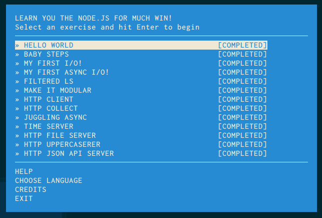
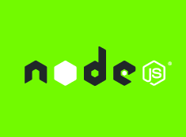
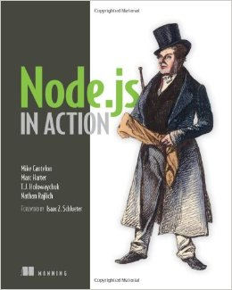
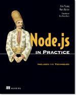
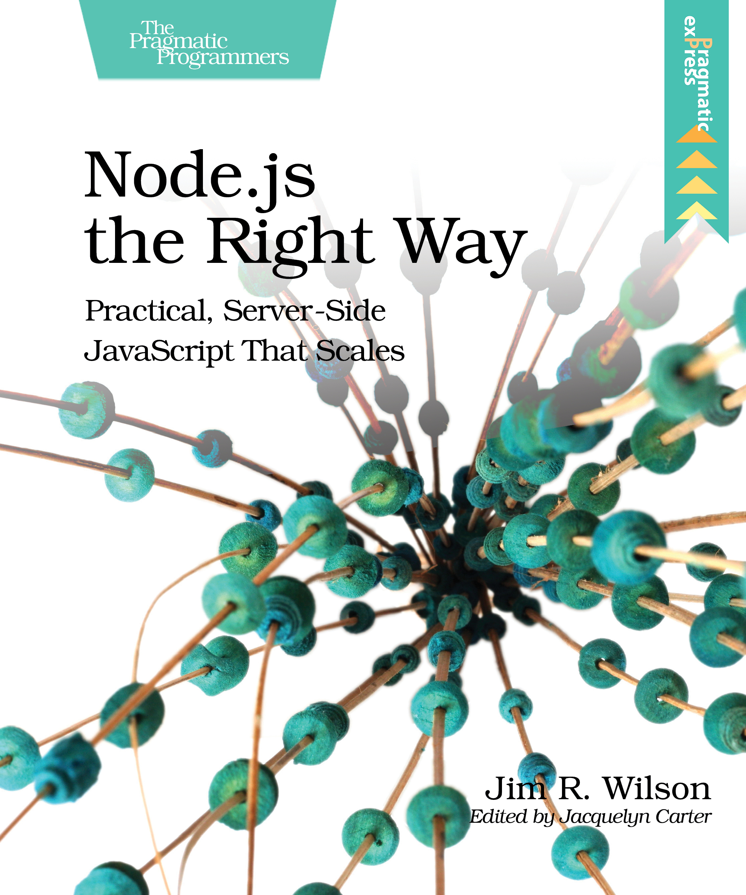
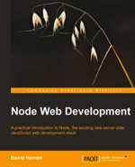

class: center, middle


# NodeSchool - *learnyounode*

[nodeschool.io/silesia](http://nodeschool.io/silesia), [@nodeschoolpl](https://twitter.com/nodeschoolpl)

[@rspective](https://twitter.com/nodeschoolpl), [@afronski](https://twitter.com/nodeschoolpl)

[](http://blog.rspective.com)

???

- Cześć!
- Witamy w grupie, która zajmować się będzie podstawami platformy Node.js.
- Korzystać będziemy z warsztatu *learnyounode*.

---

# Let's start!

1. [https://nodejs.org](https://nodejs.org)
2. `node -v`
3. `npm -v`
4. `npm install -g learnyounode`
5. `learnyounode`

???

- Jak zainstalować warsztat?
- Oto kilka kroków jakie należy wykonać, aby go zainstalować.

---

### Workshopper



???

- Oto jak wygląda ekran startowy, tuż po otwarciu warsztatu.
- Poruszamy się za pomocą kursorów, ENTER wybiera aktywną lekcję.
- Do każdego ćwiczenia dołączony jest opis zadania wraz z krótkim wprowadzeniem.

---

# Before we start...




???

- Zanim zaczniemy, opowiemy sobie czym jest `Node.js`, `io.js` i `npm`.
- Na slajdzie widzimy oficjalne logo dla wszystkich wymienionych aplikacji.

--

1. Stworzone w 2009 (*Node.js*) i 2014 (*io.js*).
???

- Pierwsza wersja *Node.js* ujrzała światło dzienne w 2009 roku, firma
  Joyent bardzo mocno wspomaga rozwój platformy.
- Po 5 latach rozwoju, gdy w 2014 tempo rozwoju znacznie zwolniło
  główni opiekunowie Node.js, niezwiązani z firmą Joyent tworzą własną
  wersję - *io.js*.

--

2. Autor: *Ryan Dahl*
???

- Autorem jest *Ryan Dahl*, pracownik firmy *Joyent*.
- Ryan po pewnym czasie wycofał się z aktywnego rozwoju platformy.

--

3. Obecnie wiele dużych firm związanych jest w rozwój platformy,
   tj. *Microsoft*, *Walmart*, *Yahoo*, *Paypal*, *Uber*, *Voxer*, *LinkedIn*, *SAP*.
4. `npm` (czyli *Node Package Manager*) został wprowadzony 2011,
???

- Platforma bardzo szybko uzyskała znaczną popularność.
- Obecnie w jej rozwój zaangażowanych jest wiele firm, w tym kilku
  dużych graczy takich jak Microsoft, Uber, eBay, Paypal, SAP, Walmart
  czy Voxer.
- Sama platforma byłaby bezużyteczna bez ekosystemu użytkowników. W
  2011 wprowadzono menadżer pakietów i centralne repozytorium, które
  rozwija się w tempie geometrycznym (obecne prawie 135 tyś pakietów).

---

# Syntax

```javascript
"use strict";

var fs = require("fs");

exports.helloWorld = function () {
  console.log("Hello World!");

  fs.readFile("/etc/passwd", "utf8", function (error, content) {
    if (error) {
      console.error("Error: %s", error);
      return;
    }

    console.log("Passwords: %s", content);
  });
};
```

???

- Zanim przejdziemy do zadań opowiemy sobie krótko o składni i zasobach.
- JavaScript FTW!
- Moduły, `require`.
- Callbacks.
- Asynchroniczne operacje I/O.

---
class: center, middle

### Resources

.books[
  
  
  
  
]

???

- I na koniec książki warte polecenia.
- Warto rozpocząć od książek *Node.js in Action* i *Node.js in Practice*.
- Bardziej zaawansowanym polecam *Node.js: The Right Way*.

---

# Image Credits

- [npmjs.org](https://www.npmjs.com)
- [nodejs.org](https://nodejs.org)
- [iojs.org](https://iojs.org/en/index.html)
- [Node.js, The Right Way](https://pragprog.com/book/jwnode/node-js-the-right-way)
- [Node.js in Action](http://www.manning.com/cantelon/)
- [Node.js in Practice](http://www.manning.com/young/)
- [Node Web Development](https://www.packtpub.com/web-development/node-web-development)

???

- Teraz możemy rozpocząć pierwsze zadanie.
- Dziękuję za uwagę!
